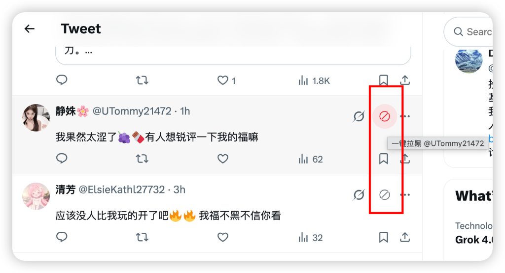

# X Block 一键拉黑

一款 Chrome（Manifest V3）浏览器插件：在 Twitter/X 每条推文（时间线、评论回复、详情页）的"三个点"按钮旁增加一个**一键拉黑**按钮。点击后自动调用 Twitter 原生拉黑流程（打开菜单 → Block → 二次确认），三步合并为一步，拉黑成功后该条推文/评论自动淡出移除。

- 不调用任何内部 API，不使用鉴权 token
- 使用语言无关的 `data-testid` 选择器，兼容多语言界面
- 权限最小化：无 background、无 popup、无 storage、无网络请求

## 效果预览

加载插件后，在 Twitter/X 的每条推文（含时间线、评论回复、详情页）右上角，三个点按钮的**左侧**会出现一个红色禁止图标。鼠标悬停会提示「一键拉黑 @用户名」，点击即自动完成原生拉黑流程并让该条推文淡出消失。



## 目录结构

```
x_block/
├── manifest.json           # 插件清单（MV3）
├── content.js              # 核心逻辑：注入按钮 + 模拟原生拉黑
├── content.css             # 按钮样式
├── icons/                  # 插件图标 16/48/128
│   ├── icon16.png
│   ├── icon48.png
│   └── icon128.png
└── assets/
    ├── icon.svg            # 图标矢量源文件（黑底 X + 红禁止圈）
    ├── render_icon.py      # 图标栅格化脚本（纯标准库，按商店规范生成各尺寸）
    ├── store-icon-1024.png # Chrome 商店上架用 1024x1024 大图
    ├── demo.png            # 效果截图
    └── gen_icons.py        # 旧版图标生成脚本（可选）
```

## 一、直接加载使用（推荐，最简单）

无需打包，开发者模式下直接加载源码目录即可：

1. 打开 Chrome，地址栏输入 `chrome://extensions/` 回车
2. 打开右上角的 **「开发者模式」** 开关
3. 点击左上角 **「加载已解压的扩展程序」**
4. 选择本项目根目录（即包含 `manifest.json` 的 `x_block` 文件夹）
5. 加载成功后访问 [x.com](https://x.com)，每条推文右上角三个点左侧会出现红色禁止图标
   - 点击该图标即一键拉黑作者，该条推文淡出消失

代码改动后，回到扩展管理页点击该插件卡片上的 **刷新（圆形箭头）** 按钮即可生效。

> Edge / Brave 等 Chromium 内核浏览器同样适用：地址栏访问 `edge://extensions/` 或 `brave://extensions/`，步骤一致。

## 二、打包成 .crx 文件（分发/固定版本）

`.crx` 是 Chrome 的扩展安装包。注意：现代 Chrome 默认只允许从 Chrome 应用商店安装 `.crx`，**本地双击安装通常会被阻止**，个人使用推荐上面的「加载已解压」方式。如需打包：

1. 打开 `chrome://extensions/`，开启「开发者模式」
2. 点击左上角 **「打包扩展程序」**
3. 「扩展程序根目录」选择本项目的 `x_block` 文件夹
4. 「私钥文件」首次打包留空（Chrome 会自动生成一个 `.pem` 私钥）
5. 点击「打包扩展程序」，会在上一级目录生成：
   - `x_block.crx` — 扩展安装包
   - `x_block.pem` — 私钥文件（**务必妥善保管**，以后升级版本打包时必须用同一个私钥）

升级版本时：先修改 `manifest.json` 里的 `version`，再次打包时在「私钥文件」处选择上次生成的 `.pem`。

## 三、打包成 .zip（上传 Chrome 应用商店 / 备份）

发布到 [Chrome Web Store](https://chrome.google.com/webstore/devconsole) 需要上传 `.zip`：

```bash
# 在项目根目录执行
zip -r x-block.zip manifest.json content.js content.css icons assets/demo.png README.md -x "*.DS_Store"
```

或手动操作：选中 `manifest.json`、`content.js`、`content.css`、`icons` 文件夹，右键压缩为 zip。注意：

- `manifest.json` 必须位于 zip **根目录**，不能多套一层文件夹
- 不要把 `.trae/`、`assets/`、`.pem` 私钥等打进发布包

## 图标重新生成（可选）

图标遵循 [Chrome 应用商店图片规范](https://developer.chrome.com/docs/webstore/images?hl=zh-cn#icons)：128×128 画布、96×96 内容区、四周透明内边距，深色主体带微弱白光晕。

- [assets/icon.svg](assets/icon.svg) 是矢量源文件，可用任意矢量编辑器打开修改
- [assets/render_icon.py](assets/render_icon.py) 是纯标准库栅格化脚本（无需安装依赖），会生成 `icons/` 下 16/48/128 三个尺寸和 `assets/store-icon-1024.png` 商店大图：

```bash
python3 assets/render_icon.py
```

## 使用说明

- 按钮出现在所有 `article[data-testid="tweet"]` 推文上，包括时间线、评论回复、提及、推文详情页
- 点击按钮后：
  1. 按钮显示加载态（旋转图标），防止重复点击
  2. 自动打开三个点菜单 → 点击 Block → 点击确认
  3. 该条推文淡出并移除
- 若某一步未找到目标（如网络慢、界面变化），会自动按 Escape 关闭弹层并恢复按钮，不会卡死
- 拉黑是调用 Twitter 原生功能，刷新后对方仍处于已拉黑状态

## 常见问题

**按钮没出现？**
- 确认插件已启用，并刷新 x.com 页面
- X 的 `data-testid` 可能随版本变化，按 F12 检查推文 DOM；如选择器失效需更新 `content.js` 顶部的 `SELECTORS`

**点击后没反应或报错？**
- 按 F12 打开 Console，查看 `[X Block]` 开头的警告日志
- 确认当前界面是登录状态，且能正常手动拉黑

**会被 X 检测封号吗？**
- 本插件只是程序化触发页面上的原生按钮点击，与手动操作等价；但任何自动化操作都存在风险，请合理使用
